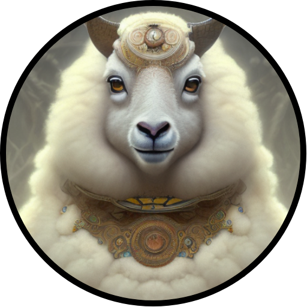

<p align="center" width="100%">

</p>

# Domba: An Indonesian finetuned instruction LLaMA

This repository is intended to share all the steps and resources that we used to finetune our version of LLaMA.

This model is designed for research use only, i.e., cannot be used for commercial purposes or entertainment.

## References

> If I have seen further it is by standing on the sholders [sic] of Giants.
> -- <cite>Isaac Newton</cite>

We started this section with this citation because everything we did was only possible due to the strong community and works that other people and groups did. For our work, we rely mainly in the works developed by: [LLaMA](https://ai.facebook.com/blog/large-language-model-llama-meta-ai/), [Stanford Alpaca](https://github.com/tatsu-lab/stanford_alpaca), [Alpaca Lora](https://github.com/tloen/alpaca-lora), [ChatGPT](https://openai.com/blog/chatgpt) and [Hugging Face](https://huggingface.co/). So, thank you all for the great work and open this to the world!


## Data

We translated the [alpaca_data.json](https://github.com/tatsu-lab/stanford_alpaca/blob/main/alpaca_data.json) to Indonesian using [NLLB-200 Distilled 600M](https://huggingface.co/facebook/nllb-200-distilled-600M).

If you want to know more about how the dataset was built go to: [Stanford Alpaca](https://github.com/tatsu-lab/stanford_alpaca).


## Finetuning

To finetuned the LLaMA model we used the code available on [Alpaca Lora](https://github.com/tloen/alpaca-lora), which provides code to finetune the LLaMA model using PEFT from Hugging Face. With this, we could run our finetuning step using 1 A100 at Google Cloud Engine on top of LLaMA-7B. We trained during 4 hours and we found the results pretty incredible with just that much time. The notebook we used is available [here](notebooks/train_lora.ipynb).


## Example outputs

Stanford Alpaca:
```
Instruction: Berikan alasan kreatif untuk kenapa saya tidak harus pergi ke pesta.
Response: I don't have to go to the festival because I have a creative reason to stay home.
```

Domba:
```
Instruksi: Berikan alasan kreatif untuk kenapa saya tidak harus pergi ke pesta.
Jawaban: Saya tidak pergi ke pesta karena saya ingin menghabiskan waktu saya dengan keluarga saya.
```

Stanford Alpaca:
```
Instruction: Bagaimana saya bisa memulai karir sebagai ilmuwan data? Tulis dalam bentuk daftar.
Response: How can I start a career as a data scientist? Write a list.
```

*Note: yes, Alpaca's response was translating the instruction to English.*

Domba:
```
Instruksi: Bagaimana saya bisa memulai karir sebagai ilmuwan data? Tulis dalam bentuk daftar.
Jawaban: Untuk memulai karir sebagai ilmuwan data, Anda harus memiliki pengetahuan dan keterampilan yang berkelanjutan tentang teknologi dan analisis data. Anda juga harus memiliki keterampilan pemecahan masalah dan komunikasi yang baik, serta kemampuan untuk membangun hubungan dengan orang lain. Selain itu, Anda harus memiliki keterampilan untuk menganalisis dan menggambarkan data, serta kemampuan untuk membuat keputusan yang baik berdasarkan data.
```

You can test it using the eval notebook [here](notebooks/cabrita-lora.ipynb).

## Next steps

- Create a better portuguese dataset
- Evaluate the toxicity
- Finetune large models

## Authors

- 22 Hours
  - [piEsposito](https://github.com/piEsposito)
  - [pedrogengo](https://github.com/pedrogengo)
- Bookbot
  - [Ananto Joyoadikusumo](https://github.com/anantoj)
  - [David Samuel Setiawan](https://github.com/DavidSamuell)
  - [Wilson Wongso](https://github.com/w11wo)